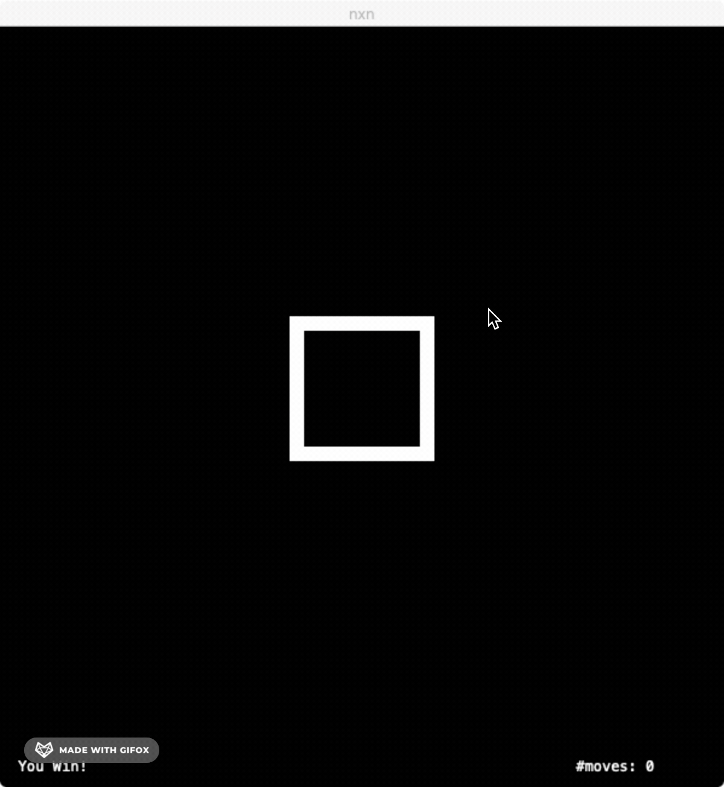
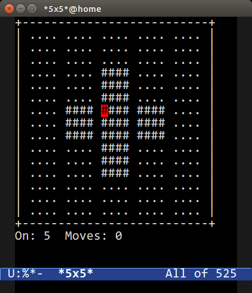

# Final Project - nxn

[](LICENSE)
[](docs/README.md)

**Author**: lipingd2@illinois.edu



This project is a port of the `5x5` game from `Emacs`, with extra features such as letting the board have dimensions other than 5 by 5.

`n x n` is a square puzzle game. When `n` = 5, we are given a 5 by 5 grid, and **the goal is to have every individual entry toggled on**. The fun (and thus also the challenge) of this game is that **when we toggle one entry, the four entries around will also get toggled.** (see example below)



## Keybindings

| Key           | Effect                                     |
| ------------- | ------------------------------------------ |
| `UP` / `K`    | Move cursor up                             |
| `DOWN` / `J`  | Move cursor down                           |
| `LEFT` / `H`  | Move cursor left                           |
| `RIGHT` / `L` | Move cursor right                          |
| `SPACE`       | Toggle at cursor location                  |
| `C`           | Activate cheat: will only toggle one entry |
| `S`           | Run the solver                             |
| `U`           | Undo                                       |
| `R`           | Redo                                       |
| `;`           | Enter Command Mode                         |

### Commands

| Command          | Effect                                                       |
| ---------------- | ------------------------------------------------------------ |
| `:reset`         | restart a game                                               |
| `:set n <value>` | set the dimension for the next game (*reset* to see effect)<br>value must be less than 15 and greater than 1</br> |
| `:q`             | quit game                                                    |
| `:e <config>`    | evaluate a config file stored in `~/.config/126nxn/`         |
| `ENTER`          | run command                                                  |
| `ESC`            | discard command                                              |

All config must be stored at `~/.config/126nxn/`. For example, if you have a config named `5x5`, then it must be placed in that folder, and in game you can start a game using that config by typing `:e 5x5` and then type `enter` on the command mode.

### Config Specification

A config specifies 2 things:

- board dimension,
- initial board

A sample config would be:

```toml
n = 3
init = [
  0, 0, 0,
  0, 1, 0,
  0, 0, 0,
]
```

This config corresponds to a 3x3 game whose initial board has a one entry lit up in the center at the beginning.

If the config contains only board dimension, the board will be empty at startup.

## Implementation Details

- The config file adopts minimal `toml` syntax. [cpptoml](https://github.com/skystrife/cpptoml) is the library that I use to parse toml files.
- The the graphics and textboxes are adopted from vanilla Cinder. No cinder blocks are used.
- Some keybindings are inspired from `vim`. For example, `hjkl` to move the cursor is borrowed from vim.
- The command mode is inspired by the command mode in `vim`.
- The cursor and entry animation is done using a critically damped harmonic oscillator.
- The solver is implemented using Gauss-Jordan Elimination in modulo 2 (more details in the `docs/README.md`)